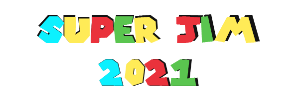

[SuperJim 2021](https://debbiect246.github.io/retrogame/) is a game produced by The Retronauts team (Matt, Monika, Ed, Deborah) for the Code Institute Retro Gaming Hackathon, which took place over a single weekend in August 2021.

We used [GitHub Projects](https://github.com/debbiect246/retrogame/projects) to keep track of all the tasks we had to do to make this app and we used GitHub collaboratively, creating a repo which we all contributed to. The collaboration was further facilitated by lengthy video calls via the Slack app.

The game is a reimagining of 1985's Super Mario Bros, with a Code Institute twist. [Mario](https://en.wikipedia.org/wiki/Super_Mario_Bros.) went on an adventure to rescue Princess Peach from the clutches of Bowser, but our Jim has an even more perilous mission: to pull an all-nighter and gather the code for his unexpected Portfolio Project 6, all 50,000 lines of it! Along the way he must battle the denizens of Imposter Syndrome (stray semi-colons included) while navigating the slippery scaffolding of his mind. A loss of focus could mean Jim unexpectedly disappears into the void of mediocrity. Will he have enough resubmissions remaining to pass?!

The powerups have changed since Mario. Mushrooms have become coffee and 1UP hearts are now support from the slack community. Jim would do well to collect uncommitted lines of code and then find a GitHub token to commit them for a huge score multipler. Jim will fail his project (lose a life) if he falls into the void or is hit by one of Imposter Syndrome's minions. A coffee will make Jim grow, granting him an extra hit from enemies and the ability to break some blocks and jump higher than before. Once all of Jim's lives are spent, it's GAME OVER.

## Wireframes

In order to have some basic structure in place and to be on the same page, we created the following wireframes for the game.  All wireframes were produced by Matt in either [balsamiq ](https://balsamiq.com/) - black and white images, or in [figma](https://www.figma.com/)- colour images:

1. [Instructions](assets/wireframes/home-page-instructions-modal.png)
2. [Home page](assets/wireframes/home-page.png)
3. [Styling](assets/wireframes/style-details.png)
4. [Super Jim](assets/wireframes/super-jim.png)

As we learned more about the relatively new KaboomJS library, the decision was made to keep the entirety of the game within the canvas element, meaning we deviated from our plans somewhat and resorted to a simple splash screen with controls within the game area itself. While a leaderboard was planned, reductions in the team members available meant we were unable to implement this within the timeframe.

## UX

* Super Jim 2021 is intended to be a fun browser based retro game for individual users to play for short periods of time. Incorporating familiar imagery to evoke memories from the users youth whilst demonstrating that great games don't require the latest 3d graphics rendering technologies. The graphical elements used immediately convey a visual indication of the fun nature of the site, along with the retro theme.

### Site Goals
* To provide users with a fun and simple game to play
* To ensure accessing the game and understanding how to play is as simple as possible
* To provide users with increasing levels of difficulty.
* To bring back the fun of the original Mario game.

### User stories

1. User wants an eerily familiar hero, with animations
2. User wants a nostalgic platform game experience, with enemies and pits to avoid
3. User wants familiar control mechanics - walk, run, jump
4. User wants to know how to control their character
5. User wants to be able to take enemies down
6. User wants to keep track of their progress/performance through their score
7. User wants a win-condition
8. User wants a leaderboard so that they can check out highest scores

### Design features

Great efforts were made to give the game a retro Mario vibe, recreating familiar assets and tilesets, juxtaposed with new custom-made sprites.

- 2D platform physics with gravity
- Fullscreen gameplay with all content contained in the canvas
- Custom sprites
- Evocative background sprite
- Animated player character
- Tight keyboard controls
- Sound effects
- Score system
- Win/loss condition

## Technologies Used

- [HTML](https://www.w3schools.com/html/) to house the canvas element.

- [CSS](https://www.w3schools.com/Css/) to remove the default margins of padding for our fullscreen game.

- [kaboom.js](https://kaboomjs.com/), a new javascript library for building canvas games quickly.

- [Chrome Developer Tools](https://developers.google.com/web/tools/chrome-devtools/) to test UI.

- We used [VS Code](https://code.visualstudio.com/) and [Gitpod](https://www.gitpod.io/) as our coding editors.

## Testing

Testing was carried out manual by all members of the team throughout its development. As each part of the game was being developed it was tested on screen checking that it worked and after it had been committed to the repo it was again tested by the person doing the commit to ensure that it worked as intended.

### Meeting User stories

1.User wants an eerily familiar hero, with animations

Jim resembles Mario and a certain member of the CI staff. He has animation states for idle, running, crouching and jumping.

2.User wants a nostalgic platform game experience, with enemies and pits to avoid

The first level of Super Mario Bros has been painstakingly adapted to include new enemies and powerups.

3.User wants familiar control mechanics - walk, run, jump

Jim can walk (ARROW keys), run (SHIFT), jump (SPACEBAR) and enter pipes (DOWN ARROW key).

4.User wants to know how to control their character

On starting a level the controls are visible on the background.

5.User wants to be able to take enemies down

Player can jump (or simply drop) onto an enemy's head to dispatch them.

6.User wants to keep track of their progress/performance through their score

Score is updated for collecting items (coins, coffee, Stack Overflow medals, Slack medals) with a multiplier for committing code via the Github medal. Score is retained between levels.

7.User wants a win-condition

Player must score 50,000 lines of code to win the game, and is presented by a win/loss scene.

8.User wants a leaderboard so that they can check out highest scores

This was not achieved within the timeframe.

### Bugs

1. Jim sometimes falls through the game map, resulting in an untimely death

Attempts to resolve this included changes to the scale of sprites, applying areas to sprites, reducing the player's maximum velocity. The issue was mitigated but is still present, albeit inconsistently

2.Boundary issues between sprites

Issues remain, as part of Matt's epic journey to create assets for the game.

3.Resonsiveness of canvas on resizing, and scaling issues

Responsiveness was not a requirement for the project, but work required to ensure scaling is fixed for different screens sizes and on browser resizing.

4.Player would die if falling on an enemy without the isJumping value being true

**Resolved** on discovery of the `falling()` Kaboom method.

5.Enemies would not bounce off solid objects when running into them

**Resolved** by reducing the scaling of wall objects

6.Animations would not advance during keyDown event listeners

**Resolved** by adding conditional statement to the event listner, checking the `isMoving` value

7.Character sprite would not change direction

**Resolved** by applying a negative scale to the x axis on the respective event listeners.

## Deployment

App was deployed to Github Pages and can be accessed [here](https://debbiect246.github.io/retrogame/).

## Breakdown of steps involved in creating the app

We all worked in different ways but overall the process used by collaborators was as follows:

1. Debbie created a new Github repo for the project.
2. Branches were created for Debbie, Matt, Ed and Monica and work was done on these branches and then pull requests made.  Pull requests were reviewed by other team members and merged when appropriate.
3. Team discussions were held about how to develop the game.  
4. Team coding sessions were done so that those people working on different parts of functionality for the game were able to ask further questions and get support in live time.
5. A project board was created in github and team members were able to select cards to work on. Matt spent some time on designing wireframes and assets for the game, Ed and Monica spent some time on the assets and scenes for the game and Debbie spent time setting up the repo, reviewing and merging some pull requests - other people could also do this for other team member's code.  Debbie also spent time updating the readme at regular intervals and coding the instruction screen and leaderboard.
6. Testing was done at regular intervals and the game reviewed during group discussions each day, usually starting around 8pm and going forward into the morning.
7. We all had to learn Kaboom JS, which is a relatively new Javascript library. We went on to use it to generate ideas for the game and to create the relevant sprites, scenes and maps. Matt created the wireframes for everyone to work from.
8. Once we had started on the initial process of creating the game, Debbie worked on the readme, keeping it up to date and monitoring the commits that were taking place as well as updating the hackathon app with details of the game's live link and Github link.
  
## Future features

- Add further levels to the game

- Add more powerups (shooting etc)

- Add animations for all other sprites, including block destruction etc

- Countdown timer could be added to the game

- Add different sprites/tilesets for level types

- Add Imposter Syndrome as a boss

- Add new enemy types/mechanics (jumping, shooting etc)

- Include actual coding relevant pickups (complete the code to advance etc)

- Add a leaderboard to the game so users can compare their scores with other users

## Credits

The [Youtube video](https://youtu.be/4OaHB0JbJDI) we all used to get up to speed with using kaboom.js was produced by Free Code Camp.

### Media  

Matt used [this colour palette from lospec.com](https://lospec.com/palette-list/endesga-64) for the design for the game.
Matt modified images from [the mushroomkingdom.net](https://themushroomkingdom.net/media/smb/wav) to create the character and objects used in the game.
Ed found [this source for the background image](https://vnitti.itch.io/) we considered multiple options before deciding that the grassy mountains were the most similar to Jim's palacial backgarden.
